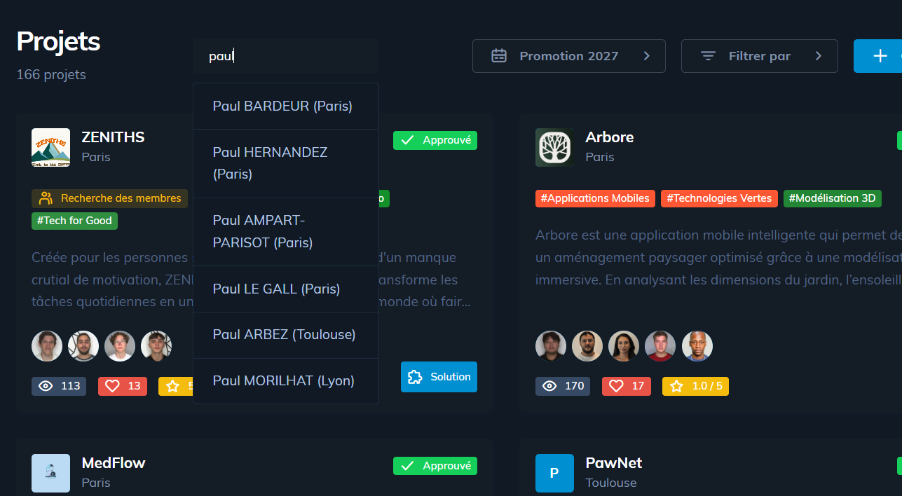

# whatIsYourEIP
An extension (for epitech students) to know an eip based on the person name when they are on eip.epitech.eu/projects

1. Clone the repo
2. Install the extension (in `brave://extensions` or `chrome://extensions`, then use developper mode to load unpack the repository path)
3. Go to https://eip.epitech.eu/projects and connect yourself
4. You should have the little placeholder where you can search your friend's EIP !

